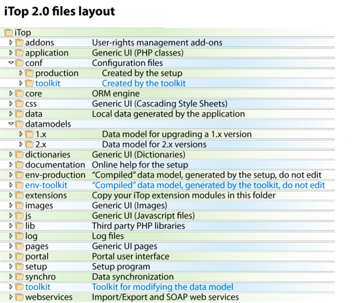
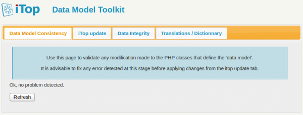
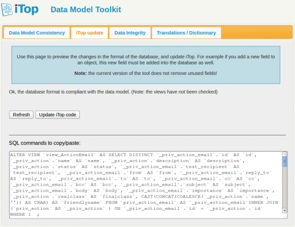
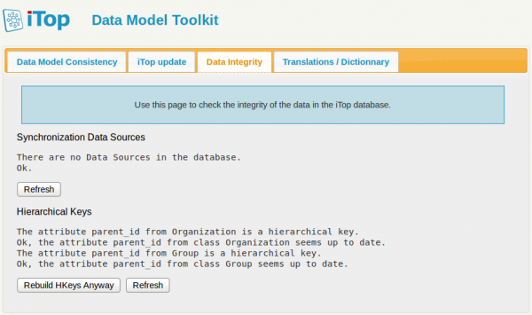

# iTop 个性化定制


>本文档基于iTop2.0. 对于老版本的iTop点击相应文档链接the old toolkit 。2.0 工具集下载地址：iTopDataModelToolkit-2.0.zip

iTop构建与ORM（Object Relational Mapper，对象关系映射）抽象层上，基于由php类组成的“元数据模型（Meta Data Model）定义之上。”iTop2.0的元数据模型采用xml文件定义，在安装或者升级过程中被编译很PHP类。

   iTop 架构如下图所示：

   
 
   上图中橙色方框表示的部分是可定制化的模块。

|    定制化类型       |  手段   |    文档       |     预期操作者       |
|:--------------------|:--------|:--------------|:---------------------|
|扩展或者修改元数据模型|XML 文件|XML reference  |iTop顾问, ITIL 专家   |
|通过插件扩展通用接口|	PHP文件	|Extensions API|PHP 开发者|
|创建新的用户接口页面实现新的web服务，特定的输出或者源于用户接口的特殊任务|	PHP文件|	ORM API| 	PHP 开发者|
|创建自己的权限表|	PHP文件|	用户权限| API |	PHP 开发者|

从iTop 2.0开始，调整元数据模型可以通过写一个简单的xml文件，此xml文件只需包含了和标准数据模型的差异。通过这种方式，
你的修改保存在一个独立的文件，这样可以保证新版本下的兼容性。这样可以保持你的个性化操作在升级后还可以正常使用。

## 理解iTop的目录结构

iTop的目录结构层次，如下图所示：


 
以下目录在iTop中有特殊的使用：

*	conf：包含了配置文件，每一个环境包含在一个子目录中（见下面环境部分）
*	data：包含了系统生成的数据，比如对象生命周期的图片（如果系统中graphviz可以用的话）。
*	Datamodels：包含了元数据模型的定义，每一个大版本包含在一个子目录中
*	env-xxxx：此目录（一个环境一个）包含了“编译”的数据模型。每次重新安装或者升级env-production目录会重新生成。
*	extensions:此目录为存放iTop非标准版本部分的扩展模块。
*	log：子目录包含了系统日志：setup.log和error.log

    所有的其他目录可以被认为是系统源代码的一部分，通常不允许修改。系统不会写数据到这些目录，他们可以被设置为对web 服务进程只读。

### 环境

  iTop 2.0 引入了环境的新概念。环境表示有相同代码但是不同数据模型和配置文件的iTop运行实例。

* 一个配置文件保存在/conf/环境名/config-itop.php
* 一个运行时数据模型保存在env-环境名目录

   两个不同的环境可以操作同样的数据，如果他们配置文件一样的话。

   为了编译xml数据模型并且测试其对线上环境的兼容性质，可以用tookit自动的创建一个独立的环境（命名为toolkit）。当变化没有问题，你可以知道toolkit把这些合法的变化应用到线上环境。

## 扩展模型

  iTop最基本的数据定义部件叫作模块。

  模块由实现给予功能的所必需的所有文件组成：数据模块定义xml文件、php类，js和css文件，php页面，图片，等等。一个模块至少包含一个文件：模块定义文件，通常命名为module.模块名.php。

  尽管你可以通过修改源文件，但是定制iTop的最好的方式是创建个性化的模块。这样你创建是一个纯净的个性化包，允许容易的安装部署以及兼容性升级。

### PHP vs XML数据模块定义

  在iTop 1.x版本中，数据模型都是通过php类来定义的。2.0开始支持php和XML两种方式的数据定义。

   
  XML定义相对于php类最大的好处是：一个模块定义的XML可以被另一个模块修改。例如，我们可以在安装时候创建一个扩展模块，这个模块在表述“Server”类的基础上增加一个属性，“Server”类是定义在标准iTop数据模型中。通过这种定义的话，用扩展模块就不需要替换整个“itop-config-management”模块（Server类定义的模块），而只需调整修改另外模块中的定义。 

   在PHP中要达到同样的效果，必须要克隆整个itop-config-mgmt模块，并且用你的的修改过的版本替换它。当一个新版本的模块发布后，你必须重做差异对比和补丁的工作，来生成你自己的模块。由于XML定义是直接定义差异，升级是自动实现的。

### 模块的构成

   如果my-module为你模块的名称，模块目录将包含以下的文件：

|      文件名	            |         描述                      
|:------------------------|:------------------------------------------------------------------------
|module.my-module.php 	|模块定义文件。必须地。包含模块的描述（名称版本，和其他类的依赖性，等）和他的组件。
|datamodel.my-module.xml |	XML的数据定义。基于此XML定义，通过“编译”生成model.xxxxxx.php文件。XML文件包含类、菜单和配置的定义。
|model.my-module.php |	如果你选择直接通过php类来定义数据模型，则用这个文件来进行定义。
|main.my-module.php 	|PHP代码和应用。有些模块包含一些PHP代码，可以容易把PHP代码抽取出来，存放到这个独立的文件中编辑，然后将其嵌入XML。
|images |	把图片（类图标，等等）存放到他们的子目录是很好的实践。 

>itop-前缀的模块名为iTop包官方模块保留字。为了避免和其他扩展命名冲突建议命名你个性化模块的名称前缀为你公司名。例如Cobodo发布的个性化模块命名为combodo-xxxx。

### 创建一个模块

  我们以一个空模块作为个性化模块创建例子作为教程的开始。首先在Toolkit工具中填写如下信息，点击生成按钮，生成此模块。


|模块名	  |`sample-module`|（必须独特。"itop-" 和 "combodo-"前缀的名称为Combodo保留字。）
|:--------|:--------------|:----------------------------------------------------------
|模块标签	| `Sample Module`|（在安装过程中显示）
|模块版本	|`1.0.0` |
|分类	 |`business`|
|依赖关系	 ||(模块名版本列表，用逗号隔开多个模块)
		

		
## 安装Toolkit

* 下载toolkit压缩包：iTopDataModelToolkit-2.0.zip
* 解压压缩包的文件到开发实例根目录/，生成一个toolkit目录。
* 通过浏览器访问这个：http://<your_itop>/toolkit

## 开发流程

* 1.创建一个空的模块
* 2.安装一个iTop开发实例，载入“extensions”目录你的空模块。
* 3.在你的开发实例中安装toolkit
* 4.编辑你的扩展模块并用toolkit工具验证修改。
* 5.把你扩展模块中的变化发布到正式环境。
* 6.用实例数据测试你的模块。如果有问题，重复4-6步骤。

  每次你对XML文件的修改都必须被编译成PHP文件，这就是toolkit所要做的工作。除此之外，你模块中的其他文件都是的从“extension/your_module”目录简单复制到“env-production/your_module”。为了加速编译过程，在linux下你可以通过过文件符号链接的形式链接到他们源文件。这样源文件目录的任何修改的都对iTop立即起作用，你只要刷新浏览器即可。

   当你扩展调试完好，你可以把它们发布到生产系统：

* 1．复制你扩展模块到生产环境的“extensions”目录。
* 2.给予配置文件读写权限。
* 3．运行安装程序，选择你扩展列表中你的模块中。

## 使用Toolkit

  当toolkit安装好后，在浏览器中输入http://<your_itop>/toolkit. 



  第一个标签页进行一些基础冲突检查和数据模型定义验证。每次当你修改数据模型定义后，使用“refresh（刷新）”按钮执行数据验证。需要说明的是此处验证的过程都是在特殊的“toolkit”环境下，对实际中生产环境下的iTop实例没有任何的影响。
 
 

   XML文件加载的顺序非常重要（特别当某个XML文件修改了另一文件的定义的模型时候）。加载的顺序是通过模块定义文件中的依赖定义来执行的。

   如果收到如下的错误信息：

      XML datamodel loader: could not find node for class/XXXX 

  这大概就是因为你的模块缺少了依赖定义，该依赖定义了XXX类。

  当setup运行编译过后，加载的顺序都被写入了配置文件。要注意的是toolkit不会自动调整加载的顺序。因此，如果你缺少了一个依赖定义，在调整模块定义文件后，需要执行安装过程，修改配置文件夹。
   
  当第一个标签页不提示任何错误后，你可跳到第二标签页操作：

* 检查数据库结构的变化
* 通过“Udpate iTop Code”执行数据库结构变化和数据模型定义到iTop生产环境


  第三个标签页用来更新数据同步源（如果任何数据模型变化有影响的话），并且检查和基础数据模型类层级继承键的差异。此页的操作直接影响生产环境。


 
## 生命周期图

   对象的生命周期图在iTop数据模型页显示（标签 Life-cycle”）。如果你修改一个对象的生命周期，你需要在web服务器安装Graphviz来重新生成这个图。关于安装Graphviz的更多信息，见iTop安装文档。


## 本地化

### 基本准则

iTop中,语言的定义的确认依赖： 

  >ISO 639-1语言码。比如: pt代表葡萄牙语
  >ISO国家码. 例如: br代表巴西。

本地化依靠字典文件, 该文件以小写iTop语言码为前缀，例如: pt_br.dictionary.itop.core.php

这些字典文件位于以下目录:

><itop-root>/dictionaries/
><itop-root>/datamodels/2.x/<module>/

需要通过安装或者tookit过程编译这些字典文件，使你添加翻译字段的生效。

## 文件格式

字典文件实际上是个php文件，文件编码必须为Utf-8（注意必须，而且注意不带DOM）。我们建议把php文件最后的PHP结束标签（`?>`）去掉，如下面的例子所示：

```
<?php

/**
 * Localized data
 *
 * @copyright   Copyright (C) 2015 John Foo Ltd
 * @author      John Foo (john@foo.com)
 * @license     http://opensource.org/licenses/AGPL-3.0
 */

Dict::Add('PT BR', 'Brazilian', 'Portuguese', array(
  'Menu:ChangeManagement' => 'Gerenciamento Mudanças',
  'Menu:Change:Overview' => 'Visão geral',
  'Menu:NewChange' => 'New Change~~',
));
```

注意:

>函数的第一个参数是大写的iTop语言码。

>第二个参数该语言是英语名称。

>第三个参数`Dict::Add`是用该语言表示的语言名称。

>`Dict::Add`行的内容在所有语言文件中都是，对同一语言的定义都必须一样（是，有点信息冗余了）。

>我们注意到字符串最后的`~~`。这个后缀不会对最终用户显示。这个是Combodo在新版本的iTop发布时候

自动添加的，用来表示该字串是新增加的，需要添加翻译。

### 如何完善已经存在的语言翻译

查找（grep）`~~`,并依次翻译。

创建一个zip压缩的升级包，发一个表单，以zip升级包为附件，我们会将其合并到下一个iTop版本的发布中去。

我们在此提供一个linux shell 单行命令，用来查找字典文件中带`~~`的项（以德语字典为例子de）

    find -name "de*dict*.php" | grep -v "env-" | xargs grep "~~"

类似，对其他语言，修改以上命令中的`de*`为其他语言的代码（fr,it,sp_,zh），在iTop的字典文件目录执行搜索。

### 如何添加一个新语言的翻译

找到你要添加语言的语言码和国家码。

复制英语的字典文件（dictionary.*.php或者en.dict.*.php）到一个对应的目录，添加对应的前缀（比如pt_br.dict_）。

对文件中的字段进行翻译，生成一个zip包，提交一个带语言zip附件的表单到下一个发布的iTop。

别忘了修改`Dict::Add `函数的参数为你自己的，否则，会因为覆盖英文字典文件触发一个运行时报错。

## License

Licensed under [Apache License 2.0](https://www.apache.org/licenses/LICENSE-2.0.html).